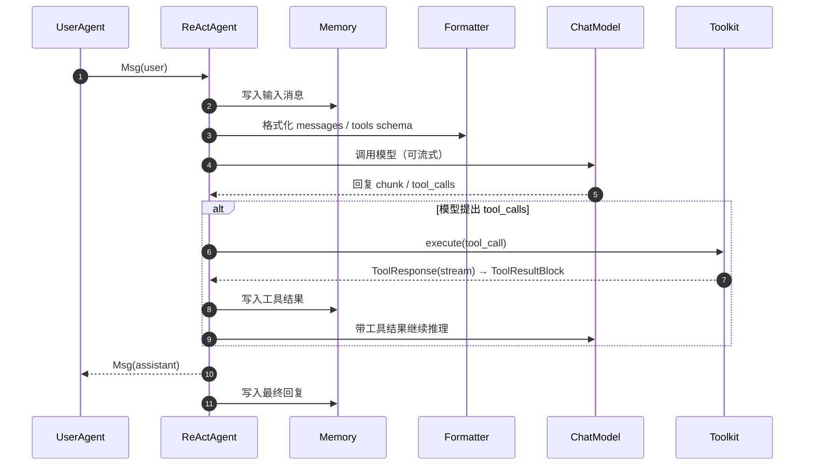
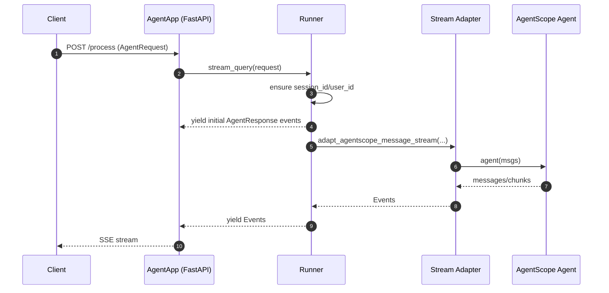
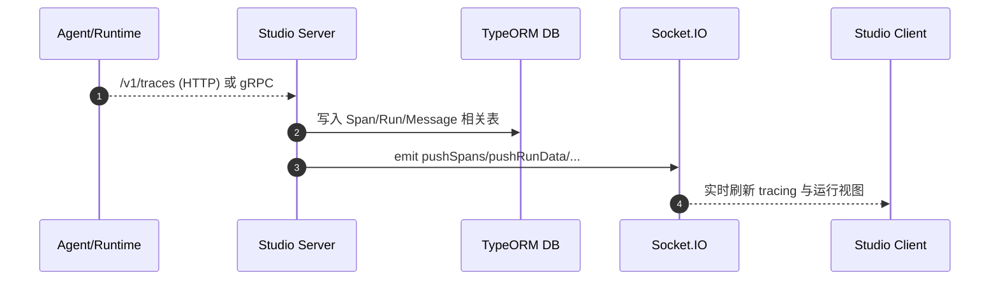
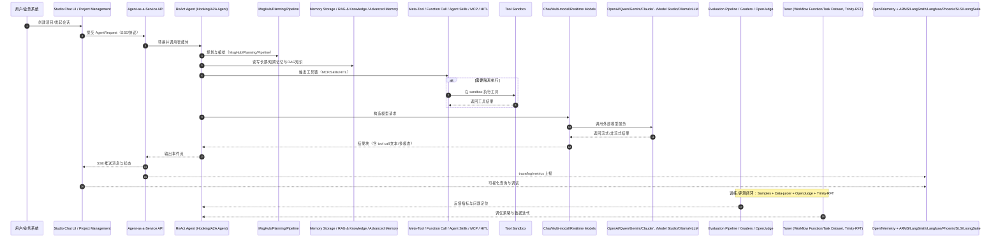

# 核心模块设计（跨项目）

本篇聚焦跨项目的“核心能力模块”，并给出其关键接口、职责边界与主要流程（含时序图）。  
具体实现细节请结合各项目子目录的设计文档阅读。

## 1. Agent 执行模型（AgentScope）

### 1.1 AgentBase：异步 agent 的统一生命周期与钩子

`AgentBase`（`agentscope-codebase/agentscope/src/agentscope/agent/_agent_base.py`）提供：

- **统一的异步调用约定**：`observe()` 接收消息但不回复；`reply()` 生成回复；`print()` 用于输出/流式打印。
- **Hook 机制**：pre/post reply、pre/post print、pre/post observe，便于插桩、控制台输出、二次开发扩展。
- **流式消息队列**：`stream_printing_messages` 会通过 `agent.set_msg_queue_enabled(True, queue)` 捕获 `print()` 输出并转为可消费的生成器流（见 `agentscope-codebase/agentscope/src/agentscope/pipeline/_functional.py`）。

### 1.2 ReActAgent：reason→act→observe 的主循环

`ReActAgent`（`agentscope-codebase/agentscope/src/agentscope/agent/_react_agent.py`）是核心开箱即用 agent，特点：

- 支持工具调用（含并行）、结构化输出、记忆压缩、RAG/知识库、TTS/语音等扩展点。
- 通过消息 block（如 `ToolUseBlock/ToolResultBlock/TextBlock`）把“工具调用”作为可观测的中间产物串联到对话与追踪链路中。

#### ReAct 主流程时序图（抽象）

## 2. 工具系统（Toolkit / MCP / Skills）

`Toolkit`（`agentscope-codebase/agentscope/src/agentscope/tool/_toolkit.py`）职责：

- 注册工具函数并自动解析 JSON schema（基于 docstring + pydantic 模型）。
- 支持工具分组（group）与激活/停用（用于“agentic tools”）。
- 支持 MCP 客户端把外部工具“映射”为本地可调用工具函数。
- 支持 Skills 目录化加载，并生成可拼接进 system prompt 的使用说明。
- 工具执行统一为“**流式** ToolResponse”接口，便于与流式模型输出合并。

## 3. 流式输出管道（stream_printing_messages）

`stream_printing_messages`（`agentscope-codebase/agentscope/src/agentscope/pipeline/_functional.py`）将 agent `print()` 输出转为可消费的 async generator：

- 在执行 `coroutine_task`（通常是 `agent(msgs)`）的同时，从共享 queue 中不断取出打印消息。
- 以 `(Msg, is_last_chunk[, speech])` 形式输出，用于 Runtime 的 SSE 或应用层 UI。

## 4. 服务化与协议适配（AgentScope Runtime）

### 4.1 AgentApp（FastAPI）：把 agent 暴露为 SSE/协议 API

`AgentApp`（`agentscope-codebase/agentscope-runtime/src/agentscope_runtime/engine/app/agent_app.py`）是 Runtime 的核心入口：

- 继承 `FastAPI`，在 `openapi()` 中按协议适配器注入 schema（A2A / Response API / AgentRequest 等）。
- 通过 lifespan 管理 runner 生命周期与 before_start/after_finish hooks。
- 支持 distributed interrupt（Redis/本地）与统一路由管理（mixins）。

### 4.2 Runner：统一事件流执行与适配

`Runner.stream_query`（`agentscope-codebase/agentscope-runtime/src/agentscope_runtime/engine/runner.py`）提供：

- 请求合法性校验与 `session_id/user_id` 补全。
- 以 `Event/AgentResponse` 序列号化输出（适配 SSE）。
- 针对 framework type（例如 `agentscope`）选择 stream adapter，把 AgentScope 的消息流适配为 Runtime 事件流。

#### Runtime SSE 主流程时序图

## 5. Sandbox 安全执行（Runtime SandboxManager）

`SandboxManager`（`agentscope-codebase/agentscope-runtime/src/agentscope_runtime/sandbox/manager/sandbox_manager.py`）支持两种模式：

- **本地模式**：直接使用容器客户端（Docker/K8s）创建/管理 sandbox 容器，并维护 container/session 映射（Redis 或内存）。
- **远端模式**：通过 HTTP/Async HTTP 把调用代理到远端 sandbox 服务（带 bearer token）。

其 `remote_wrapper/remote_wrapper_async` 装饰器模式，使同一方法可在“本地/远端”双栈运行。

## 6. 可视化与可观测（Studio）

Studio server（`agentscope-codebase/agentscope-studio/packages/server/src/index.ts`）展示出典型的三条通路：

- **TRPC API**：`/trpc`（Express middleware）
- **OTEL HTTP**：`/v1`（支持 protobuf/octet-stream/json）
- **OTEL gRPC**：单独端口启动 gRPC server（失败则仅 HTTP 接收）

并通过 `SocketManager`（`.../trpc/socket.ts`）将 runs/messages/spans 等数据推送给 client，实现“近实时”可视化。

#### Studio：OTEL → 入库 → 推送（抽象时序图）

## 7. 架构图主链路时序图（全局视角）

以下时序图将架构图中的主块串起来：**Model Providers → AgentScope Core（Model/Tool/Agent/Memory/Orchestration）→ Runtime（AaaS/Sandbox/Deployment）→ Studio（Tracing/Project/Chat UI）→ 观测平台（OTel 生态）**。

## 8. 模块覆盖校核（对应架构图）

为便于评审，本套文档已覆盖以下图中主模块族：

- AgentScope：Model / Tool / Agent / Context & Memory / Orchestration / Tuner / Evaluation
- Runtime：Tool Sandbox / Deployment / Agent-as-a-Service API / Agent Serving
- Studio：Tracing / Evaluation Visualization / Project Management / Friday / Chat UI
- 生态：模型提供方、观测平台、部署环境、协议、第三方框架、Samples 场景

