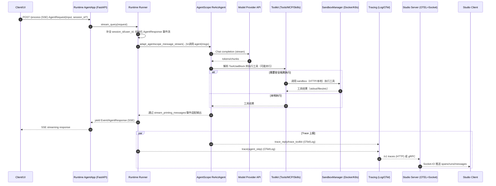

# 总体设计（跨项目）

## 1. 背景与目标

AgentScope 生态由「框架（AgentScope）+ 运行时（AgentScope Runtime）+ 可视化（Studio）+ UI 组件库（Spark Design）+ 示例（Samples）」组成，目标是以可扩展的抽象构建智能体应用，并在生产环境中提供可部署、可观测、可迭代的运行闭环。

## 2. 系统边界与组件划分

### 2.1 逻辑组件

- **AgentScope（框架）**：提供 Agent 抽象、消息类型、模型适配、工具调用、记忆、pipeline 等能力。
  - 代表实现：`ReActAgent`（`agentscope-codebase/agentscope/src/agentscope/agent/_react_agent.py`）、`Toolkit`（`.../tool/_toolkit.py`）、`stream_printing_messages`（`.../pipeline/_functional.py`）。
- **AgentScope Runtime（运行时/部署）**：提供 Agent-as-a-Service（FastAPI）、协议适配（A2A/Response API/AGUI）、会话/中断、Sandbox 安全工具执行、部署管理、Tracing（OTel/日志）。
  - 代表实现：`AgentApp`（`agentscope-codebase/agentscope-runtime/src/agentscope_runtime/engine/app/agent_app.py`）、`Runner`（`.../engine/runner.py`）、`SandboxManager`（`.../sandbox/manager/sandbox_manager.py`）。
- **AgentScope Studio（本地可视化）**：本地 server + client，用于项目与运行管理、消息可视化、Tracing/评测等；支持 OTEL gRPC/HTTP 接收链路与 Socket.IO 实时推送。
  - 代表实现：server 启动（`agentscope-codebase/agentscope-studio/packages/server/src/index.ts`）、DB（`.../database.ts`）、Socket（`.../trpc/socket.ts`）。
- **Spark Design（UI 组件库）**：`@agentscope-ai/design`（通用组件/主题/i18n）与 `@agentscope-ai/chat`（聊天组件），用于构建 AI 交互 UI（Studio/Samples 可复用）。
  - 仓库结构见 `agentscope-codebase/agentscope-spark-design/README.md`。
- **Samples（示例）**：以“功能/场景”为组织方式，提供纯 Python 与 fullstack runtime 示例（前后端 + Runtime）供参考落地。
  - 结构见 `agentscope-codebase/agentscope-samples/README.md`。

### 2.2 物理部署视角（典型）

- **纯本地**：Python 应用直接调用 AgentScope（无 Runtime、无 Studio）。
- **本地服务化**：Runtime 启动 FastAPI 对外提供 SSE/协议 API；可选接入 Studio 做可视化与追踪。
- **生产化**：Runtime + Sandbox（Docker/K8s）+ 可观测（OTel）+（可选）Studio/自研 UI。

## 3. 关键数据模型（抽象层）

- **消息（Msg/Block）**：Agent 输入输出统一为消息对象，工具调用使用 `ToolUseBlock/ToolResultBlock` 等 block 表达（见 `ReActAgent`/`AgentBase` 相关引用）。
- **工具（Tool Function / MCP / Skill）**：`Toolkit` 负责注册工具函数、MCP 客户端与 Skills，并以统一的“流式 ToolResponse”接口执行（`agentscope-codebase/agentscope/src/agentscope/tool/_toolkit.py`）。
- **会话与状态**：
  - 框架侧：Memory/Session 模块用于持久化对话与状态（在代码中以 module 方式组织）。
  - Runtime 侧：`AgentRequest` 携带 `session_id/user_id`，`Runner.stream_query` 会补全并以事件流形式输出（`agentscope-codebase/agentscope-runtime/src/agentscope_runtime/engine/runner.py`）。

## 4. 主要端到端流程（时序图）

下面用一个“典型服务化 + 可观测 + UI”的主流程描述跨组件协作：用户请求 → Runtime API → AgentScope ReAct → 模型/工具 → Sandbox → Trace → Studio UI。

> 设计依据（代码入口）：  
> - `AgentApp` FastAPI 化与路由/协议注入：`agentscope-codebase/agentscope-runtime/src/agentscope_runtime/engine/app/agent_app.py`  
> - `Runner.stream_query` 的事件流与 session_id/user_id 补全：`agentscope-codebase/agentscope-runtime/src/agentscope_runtime/engine/runner.py`  
> - `ReActAgent` 以 Msg/Block 驱动 reasoning→act→observe：`agentscope-codebase/agentscope/src/agentscope/agent/_react_agent.py`  
> - `Toolkit` 的工具注册与执行（含 middleware/MCP/Skills）：`agentscope-codebase/agentscope/src/agentscope/tool/_toolkit.py`  
> - Studio server 的 OTEL/Socket/DB：`agentscope-codebase/agentscope-studio/packages/server/src/index.ts`、`.../database.ts`、`.../trpc/socket.ts`

## 5. 非功能性设计要点

- **可观测性**：框架与运行时均具备 tracing 能力（Runtime 侧显式提供 Log/Report/OTel 的组合，见 `agentscope-codebase/agentscope-runtime/src/agentscope_runtime/engine/tracing/README.md` 及中文补齐版本）。
- **安全性**：Runtime SandboxManager 支持本地/远端模式与容器隔离执行（Docker/K8s），并支持 Redis/本地映射维护 session/container 状态（`.../sandbox/manager/sandbox_manager.py`）。
- **可扩展性**：
  - 工具：Toolkit 支持函数 schema 自动解析、工具分组激活、MCP 客户端、Skills 目录化加载。
  - 协议：AgentApp 支持 A2A / Response API / AGUI 协议适配并注入 OpenAPI schema。

## 6. 架构图模块全覆盖清单（`agentscope_20260120.png`）

> 目标：确保图中**每个模块**都在设计文档中有对应说明或归属。
> 参考图文件：`agentscope-codebase/agentscope/assets/images/agentscope_20260120.png`

### 6.1 模型与服务提供方（左侧）

- Claude
- deepseek
- Gemini
- GLM
- OpenAI
- Qwen
- Azure
- Model Studio
- Ollama
- vLLM
- SGL
- NACOS

设计归属：上述提供方通过 AgentScope 的 `ChatModel/Multimodal/Realtime` 适配层接入，NACOS 在生态层用于服务发现/治理场景（按部署方案接入）。

### 6.2 数据与记忆底座（顶部中间）

- MySQL
- ORACLE
- PostgreSQL
- TableStore
- Qdrant
- mem0
- SQL Server
- OSS
- SQLite
- redis
- Milvus
- ReMe

设计归属：对应 AgentScope 的 Context & Memory（Memory Storage/RAG & Knowledge/Advanced Memory）与 Runtime 的状态/会话/追踪存储；向量库与记忆服务由 RAG/Memory 相关模块或外部服务接入。

### 6.3 AgentScope-Samples（开箱即用 Agents）

- Alias: General Assistant
- QA
- Browser-use
- Data-Juicer Agent
- Voice Agent
- Financial Analysis
- Data Science
- EvoTrader
- Deep Research
- More...

设计归属：均在 `agentscope-samples` 中体现，按“纯 Python / fullstack runtime”两种范式落地。

### 6.4 AgentScope（核心框架模块）

#### Model

- Chat Model
- Multi-modal Model
- Realtime Model

#### Tool

- Meta-Tool
- Function Call
- Agent Skills
- MCP Support
- Human-in-the-loop

#### Agent

- ReAct Agent
- Hooking Function
- A2A Agent

#### Context & Memory

- Memory Storage
- RAG & Knowledge
- Advanced Memory

#### Orchestration

- MsgHub
- Planning
- Pipeline

#### Tuner

- Workflow Function
- Task Dataset

#### Evaluation

- Evaluation Pipeline
- Graders

设计归属：以上均由 AgentScope 主仓中对应模块实现或示例覆盖（详见各子项目文档）。

### 6.5 AgentScope-Studio（图中模块）

- Tracing
- Evaluation Visualization
- Project Management
- Friday
- Chat UI

设计归属：Studio server/client + DB + Socket 架构中分别提供实时追踪、评测可视化、项目/运行管理与交互界面能力。

### 6.6 AgentScope-Runtime（图中模块）

- Tool Sandbox
- Deployment
- Agent-as-a-Service API
- Agent Serving

设计归属：Runtime 的 `SandboxManager + DeployManager + AgentApp/Runner` 对应实现服务化、部署与安全执行。

### 6.7 观测与评测生态（右侧）

- ARMS
- OpenTelemetry
- LoongSuite
- LangSmith
- Langfuse
- Phoenix
- SLS

设计归属：Runtime/Studio tracing 与外部观测平台对接，OTel 为核心标准接口。

### 6.8 周边生态与工具（右侧与底部）

- Data-juicer
- Trinity-RFT
- OpenJudge
- Spark Design

设计归属：分别对应数据处理、强化微调、评测框架与 UI 组件库生态位。

### 6.9 部署、协议与框架兼容（底部）

#### 部署环境

- ACK
- Kubernetes
- Docker
- FC
- Model Studio
- Knative

#### 协议/接口

- A2A
- A2UI
- AG-UI
- Response API

#### 多框架生态

- Agno
- crewai
- AutoGen
- LangGraph
- Microsoft Agent Framework
- More...

设计归属：由 Runtime 的部署层与协议适配层承接，并通过 adapter/协议路由实现跨框架兼容。

### 6.10 Sandbox 提供方生态（左下）

- AgentBay
- BoxLife
- E2B
- gVisor

设计归属：以上能力位于 Runtime 的 Tool Sandbox 生态层，作为安全执行底座候选，与 Docker/K8s/Serverless 运行环境组合使用。

