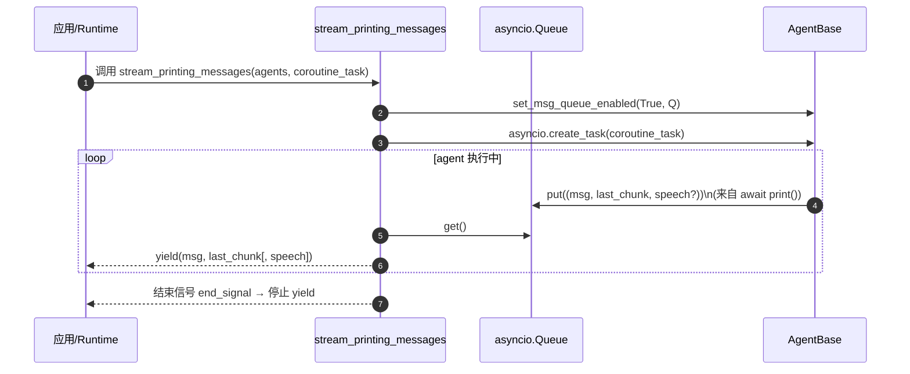

# AgentScope 核心模块设计

## 1. AgentBase：Hook 与流式打印队列

**实现位置**：`agentscope-codebase/agentscope/src/agentscope/agent/_agent_base.py`

### 1.1 Hook 设计

`AgentBase` 支持以下 hook 类型（类级与实例级两套）：

- `pre_reply` / `post_reply`
- `pre_print` / `post_print`
- `pre_observe` / `post_observe`

用途：

- pre hooks：可修改输入参数（例如注入上下文、裁剪消息、追加元信息）
- post hooks：可替换输出（例如脱敏、结构化包装、审计记录）

### 1.2 流式打印队列

`stream_printing_messages` 会开启 agent 的“消息队列模式”，只要 agent 逻辑中调用 `await self.print(msg)`，该中间消息就会被写入共享 queue 并被上层消费（用于 SSE/UI）。

**实现位置**：`agentscope-codebase/agentscope/src/agentscope/pipeline/_functional.py`

#### 流式打印聚合时序图

## 2. ReActAgent：结构化中间产物（ToolUse/ToolResult）

**实现位置**：`agentscope-codebase/agentscope/src/agentscope/agent/_react_agent.py`

设计要点：

- 使用 `ToolUseBlock/ToolResultBlock` 把工具调用显式建模为消息内容的一部分，使得：
  - 模型可依据工具结果继续推理
  - tracing/可视化可直接展示“调用了什么工具、入参/出参是什么”
- 内置多项增强能力：并行工具调用、结构化输出、记忆压缩、RAG/知识库、TTS 等。

## 3. Toolkit：工具注册、Schema 推导与统一执行

**实现位置**：`agentscope-codebase/agentscope/src/agentscope/tool/_toolkit.py`

### 3.1 工具注册与 Schema 推导

Toolkit 支持：

- 从工具函数 docstring 自动解析参数 schema
- 用 pydantic 动态扩展 JSON schema
- tool group 激活/停用：使模型只看到当前允许的工具集合

### 3.2 工具执行与中间件

`_apply_middlewares` 支持在运行时构造 middleware chain，对每次工具调用做统一处理（鉴权、审计、限流、重试、超时等）。

> 设计提醒：工具中间件需为 async generator 形态并 yield `ToolResponse`，以统一流式接口。

## 4. Pipeline：顺序/并发编排

**实现位置**：`agentscope-codebase/agentscope/src/agentscope/pipeline/_functional.py`

- `sequential_pipeline`：把上一个 agent 的输出作为下一个输入（最小抽象的“串行编排”）
- `fanout_pipeline`：同一输入分发给多个 agent，可并发 gather 或串行执行（适合“多视角并行”）

