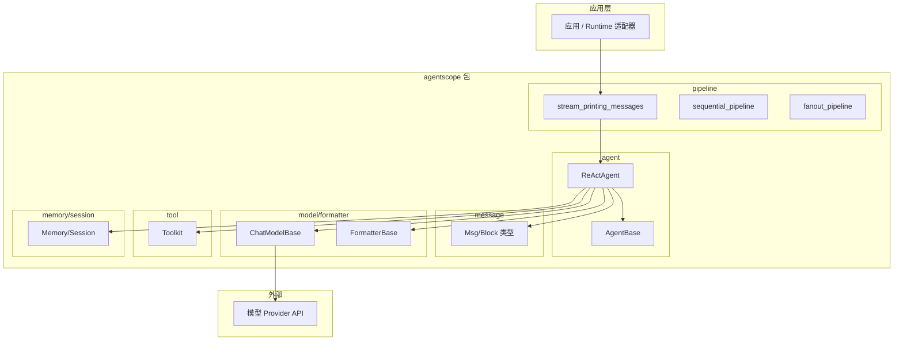
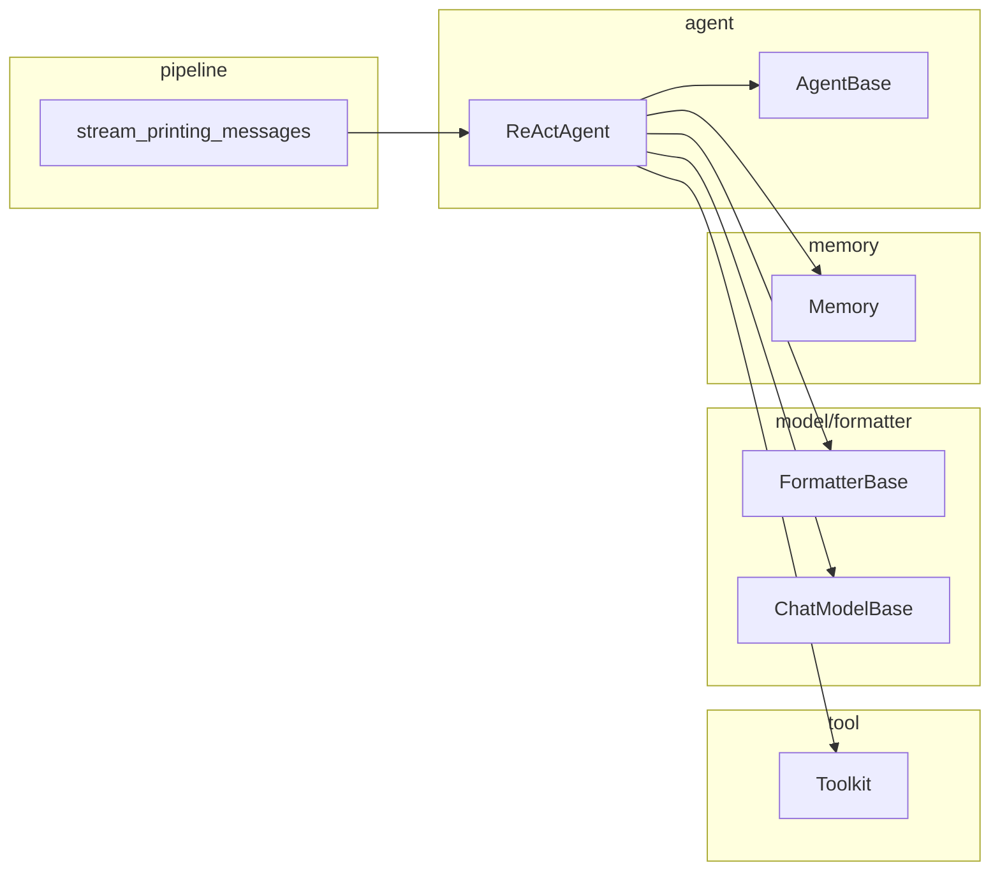
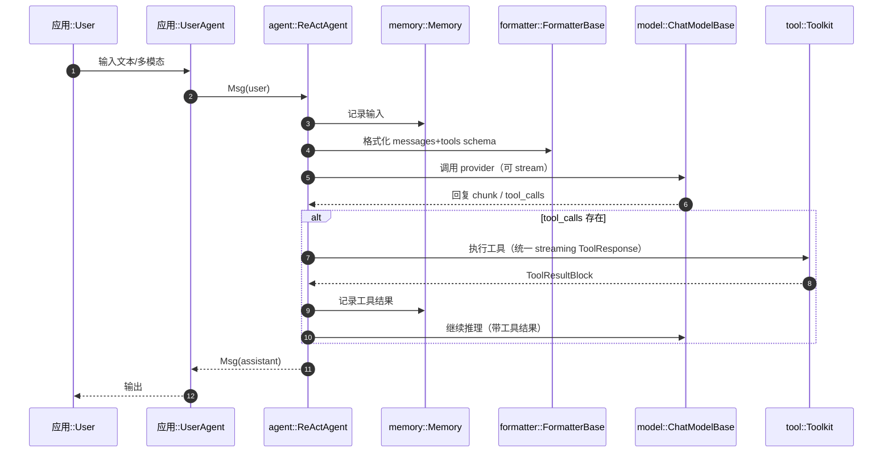

# AgentScope（框架）总体设计

> 代码根目录：`s:\agentscope\agentscope-codebase\agentscope`  
> Python 包入口：`agentscope-codebase/agentscope/src/agentscope`

## 1. 定位与目标

AgentScope 是面向智能体（Agent）的应用开发框架，提供一套可组合的抽象，用于：

- 定义/编排异步智能体（Agent）
- 统一消息与多模态内容表达（Msg + Blocks）
- 适配多模型 Provider（ChatModel + Formatter）
- 统一工具调用与生态集成（Toolkit / MCP / Skills）
- 记忆与状态（Memory / Session）
- 工作流与管道（pipeline，含流式输出聚合）
- 可观测（tracing）与语音能力（tts/realtime）

## 2. 模块划分（按职责）

### 2.1 Agent 层

- `AgentBase`：异步 agent 基类、hook、流式输出队列能力（`src/agentscope/agent/_agent_base.py`）
- `ReActAgent`：开箱即用 ReAct 实现，支持工具调用、结构化输出、记忆压缩、RAG 等（`src/agentscope/agent/_react_agent.py`）

### 2.2 Message/Block 层

Agent 输入输出以 `Msg` 表达，内容以 block 组合（如 `TextBlock/ToolUseBlock/ToolResultBlock/AudioBlock`），便于：

- 把工具调用“结构化地”嵌入对话链路
- 对流式输出进行分块与合并
- 为 tracing/可视化提供稳定的结构化载体

（Block 类型在 `ReActAgent`/`AgentBase` 引用中可见）

### 2.3 代码结构分析

包根路径：`agentscope-codebase/agentscope/src/agentscope/`。

| 目录/模块 | 职责 | 代表文件 |
|-----------|------|----------|
| `agent/` | Agent 基类与 ReAct 等实现 | `_agent_base.py`、`_react_agent.py` |
| `message/` | Msg、Block 类型定义 | 消息与块结构 |
| `model/` | 模型 API 封装（Chat/Multimodal/Realtime） | 各 provider 适配 |
| `formatter/` | 将 Msg/Block 转为 provider 请求格式 | `_openai_formatter.py` 等 |
| `tool/` | Toolkit、工具注册与执行、MCP、Skills | `_toolkit.py`、`_coding/`、`_multi_modality/` |
| `pipeline/` | 编排与流式聚合 | `_functional.py`（stream_printing_messages、sequential_pipeline、fanout_pipeline） |
| `memory/` | 记忆与状态 | `_working_memory/`、`_long_term_memory/`（mem0、reme） |
| `session/` | 会话抽象 | 会话状态管理 |
| `rag/` | RAG 与知识库 | `_reader/`、`_store/` |
| `evaluate/` | 评测管道与 Graders | `_evaluator/`、`_ace_benchmark/` |
| `tune/`、`tuner/` | 调优与工作流 | 任务数据集与工作流函数 |
| `tracing/` | 追踪上报 | 与 Runtime/Studio 对接 |
| `mcp/`、`a2a/` | MCP 与 A2A 协议 | 协议适配 |
| `plan/`、`realtime/`、`tts/` | 规划、实时、语音 | 扩展能力 |

### 2.5 Model/Formatter 层

AgentScope 把模型调用拆为：

- `ChatModelBase`：负责和具体 provider API 交互（例如 DashScope/OpenAI 等）
- `FormatterBase`：把 Msg/Block 转换为 provider 所需的请求结构

这种拆分让“同一对话结构”可被不同 provider 消费。

### 2.6 Tool 层（Toolkit/MCP/Skills）

`Toolkit`（`src/agentscope/tool/_toolkit.py`）提供统一的工具注册、分组管理、schema 推导、执行与流式结果输出，并支持：

- MCP client 将外部工具映射为本地工具函数
- Skills 目录化加载（`SKILL.md`）并生成 system prompt 注入片段

### 2.7 Pipeline 层（工作流/流式聚合）

`src/agentscope/pipeline/_functional.py` 提供：

- `sequential_pipeline`：串行执行多个 agent
- `fanout_pipeline`：并发/串行 fanout 执行多个 agent
- `stream_printing_messages`：在执行 agent 协程时，聚合 agent `print()` 的中间消息并流式产出

## 3. 典型使用方式

- 纯框架本地运行：应用直接构建 `ReActAgent`，配置 model/formatter/toolkit/memory，驱动对话循环（参见 samples 里的 chatbot）。
- 与 Runtime 联合：通过 `stream_printing_messages` 等能力将中间消息转为流式事件，供服务化输出或 Studio 可视化。

## 4. 技术架构框图

## 5. 模块调用关系图

## 6. 主要流程时序图（ReAct + 工具）

参与者采用 **模块::参与者** 形式标注来源。

## 7. 关键扩展点

- **Hooks**：`AgentBase` 提供 pre/post reply/print/observe，适合做安全检查、记录、审计、提示注入、输出控制等。
- **工具中间件**：`Toolkit` 支持 middleware 链（见 `_apply_middlewares` 设计），适合做权限、限流、审计、重试等。
- **记忆压缩**：`ReActAgent` 内置 `CompressionConfig` 与结构化摘要 schema（用于上下文窗口受限场景）。

