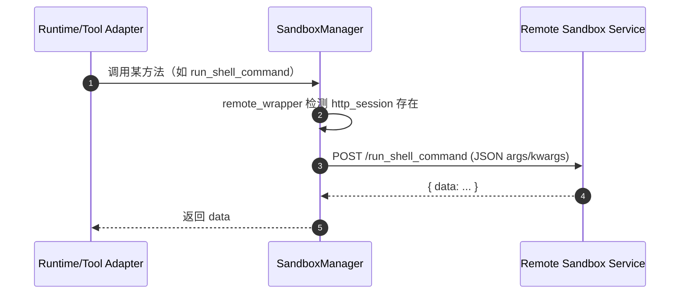

# AgentScope Runtime 核心模块设计

## 1. AgentApp：FastAPI + Runner 的组合

**实现位置**：`agentscope-codebase/agentscope-runtime/src/agentscope_runtime/engine/app/agent_app.py`

### 1.1 OpenAPI schema 注入

`AgentApp.openapi()` 在生成基础 schema 后，会按已启用的 `protocol_adapters` 注入额外 schema：

- A2A：注入 `A2ARequest`
- Response API：注入 `ResponseAPI`
- 始终注入：`AgentRequest`

这使得同一服务可在不同协议入口下保持契约一致，并减少外部对协议差异的理解成本。

### 1.2 生命周期（lifespan）与 hooks

`AgentApp` 将用户自定义 `lifespan` 与内部 runner 生命周期组合：

- 内部：`_internal_framework_lifespan` 负责构建并启动 Runner（`await self._runner.__aenter__()`），并在退出时停止。
- 外部：`before_start/after_finish` 提供轻量 hook，用于启动前资源初始化与结束清理。

## 2. Runner.stream_query：事件流状态机

**实现位置**：`agentscope-codebase/agentscope-runtime/src/agentscope_runtime/engine/runner.py`

关键设计点（从代码可见）：

- **健康检查**：`self._health` 未启动会拒绝执行（指导使用 `await runner.start()`）。
- **ID 补全**：request 若缺 `session_id/user_id` 会自动生成/补齐。
- **序列号**：`SequenceNumberGenerator` 为每个事件赋序号，便于前端正确合并流式消息。
- **状态推进**：先 yield 初始 response，再切换 in_progress，随后进入 adapter 驱动的主循环。

## 3. SandboxManager：本地/远端双栈执行

**实现位置**：`agentscope-codebase/agentscope-runtime/src/agentscope_runtime/sandbox/manager/sandbox_manager.py`

### 3.1 远端模式（HTTP 代理）

当 `base_url` 存在时：

- 初始化 `requests.Session()` 与 `httpx.AsyncClient()`
- 可选 bearer token 注入 `Authorization: Bearer <token>`
- 通过 `remote_wrapper` / `remote_wrapper_async` 装饰器：
  - 自动把方法名映射为远端 endpoint：`/<func.__name__>`
  - 自动将 args/kwargs 按签名拼装成 JSON 请求体
  - 将远端响应的 `data`（或指定 `success_key`）作为方法返回值

### 3.2 本地模式（容器/资源管理）

当 `base_url` 为空：

- 读取/构造 `SandboxManagerEnvConfig`（本地文件系统、redis 可选、docker 默认等）
- 初始化 Redis/内存映射与队列，用于维护 container/session 关系与 sandbox pool
- 通过 `ContainerClientFactory.create_client(...)` 创建本地容器客户端（Docker/K8s）

#### Sandbox 调用抽象时序图（远端模式）

## 4. DeployManager：部署平台解耦接口

**实现位置**：`agentscope-codebase/agentscope-runtime/src/agentscope_runtime/engine/deployers/base.py`

设计意图：

- 将“部署/停止”抽象为接口，让 Runner/AgentApp 不绑定具体平台。
- 通过 `state_manager` 统一记录部署状态，便于恢复与运维。

