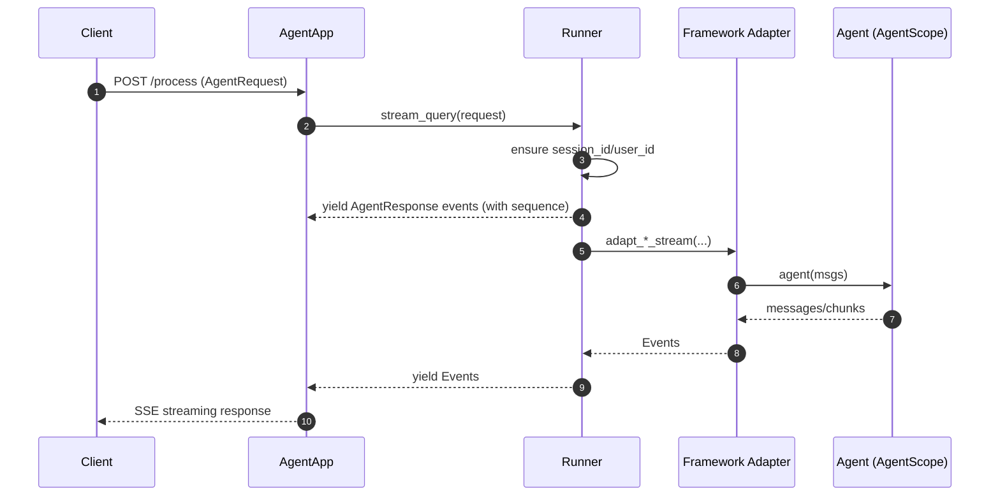

# AgentScope Runtime 总体设计

> 代码根目录：`s:\agentscope\agentscope-codebase\agentscope-runtime`  
> Python 包入口：`agentscope-codebase/agentscope-runtime/src/agentscope_runtime`

## 1. 定位与目标

AgentScope Runtime 提供“生产级运行时”能力，将智能体应用以 **Agent-as-a-Service** 的方式对外暴露，并补齐生产所需能力：

- **API 服务化**：以 FastAPI 承载，支持 SSE 流式输出
- **协议适配**：A2A / Response API / AGUI 等（通过 protocol adapters 注入）
- **安全工具执行**：Sandbox（Docker/K8s/远端），隔离执行 Shell/GUI/Browser/FS 等
- **可观测性**：Log + OpenTelemetry Report
- **部署管理**：本地/容器/K8s/Serverless 等（DeployManager）
- **可控中断**：distributed interrupt（Redis/本地）

## 2. 核心对象与分层

### 2.1 AgentApp（FastAPI 入口）

**实现位置**：`agentscope-codebase/agentscope-runtime/src/agentscope_runtime/engine/app/agent_app.py`

设计特征：

- `AgentApp` 直接继承 `FastAPI`，并通过 mixin 组合路由与中断能力。
- `openapi()` 会按 `protocol_adapters` 注入协议相关 schema（例如 A2ARequest、ResponseAPI、AgentRequest）。
- 通过 lifespan（`_lifespan_manager` / `_internal_framework_lifespan`）管理 Runner 生命周期与 before_start/after_finish hooks。

### 2.2 Runner（执行内核）

**实现位置**：`agentscope-codebase/agentscope-runtime/src/agentscope_runtime/engine/runner.py`

职责：

- 统一 health/start/stop 生命周期
- 统一 `stream_query()`：校验 framework type、补全 `session_id/user_id`、产出带序列号的事件流
- 选择并调用对应 framework adapter（例如 `agentscope` 适配器），把框架输出映射为 Runtime `Event`
- 支持 `deploy()`：委托 `DeployManager` 完成部署

### 2.3 DeployManager（部署抽象）

**实现位置**：`agentscope-codebase/agentscope-runtime/src/agentscope_runtime/engine/deployers/base.py`

抽象方法：

- `deploy(...) -> {deploy_id, url}`
- `stop(deploy_id, ...) -> {success, message, details}`

### 2.4 SandboxManager（安全执行与资源管理）

**实现位置**：`agentscope-codebase/agentscope-runtime/src/agentscope_runtime/sandbox/manager/sandbox_manager.py`

特点：

- 同时支持本地容器管理与远端 HTTP 代理模式
- Redis/内存的 session/container 映射与 pool queue
- 本地模式下根据 deployment_type 创建 container client（Docker/K8s）
- 通过装饰器（`remote_wrapper(_async)`）让同一方法在“本地/远端”双栈工作

## 3. 主要流程时序图（Agent API /process）

## 4. 可观测性与中断

- **Tracing**：Runner 的 `stream_query()` 使用装饰器 `@trace(TraceType.AGENT_STEP, ...)`（见 `runner.py`）对执行步骤进行追踪。
- **Interrupt**：AgentApp 在初始化中根据配置选择 Redis 或 Local backend（见 `AgentApp._setup_interrupt_service()`），实现可控打断。

