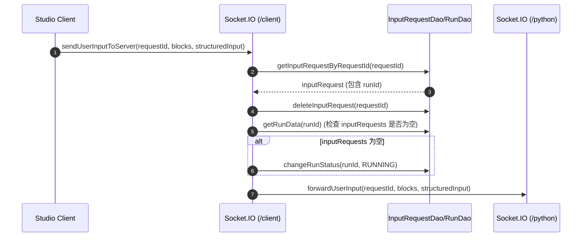

# AgentScope Studio 核心模块设计

## 1. Server：路由与端口管理

**实现位置**：`agentscope-codebase/agentscope-studio/packages/server/src/index.ts`

### 1.1 端口探测与非交互启动

Server 使用 `portfinder`：

- 探测 HTTP 端口（默认来自配置）
- 探测 OTEL gRPC 端口

当端口被占用时：

- 交互终端：提示用户是否使用新端口
- 非交互模式：自动切换到可用端口

该设计适配 CI/自动化环境与本地开发两种形态。

## 2. 数据库（TypeORM）

**实现位置**：`agentscope-codebase/agentscope-studio/packages/server/src/database.ts`

关键点：

- `synchronize: true` + `migrationsRun: true`：启动时自动同步与迁移（需关注生产环境的策略）
- entities 覆盖 runs/messages/replies/spans 等核心表
- 启动后调用 DAO 做一次“状态修复/刷新”（run status、input requests）

## 3. OTEL 接收链路

从 `index.ts` 可见两条接收路径：

- **HTTP**：`/v1`，使用 `express.raw()` 接收 protobuf/octet-stream/json，然后交由 `otelRouter` 处理。
- **gRPC**：`OtelGrpcServer.start(port)` 在独立端口启动；若失败，则提示并退化为仅 HTTP 接收。

## 4. SocketManager：三类 namespace 与房间模型

**实现位置**：`agentscope-codebase/agentscope-studio/packages/server/src/trpc/socket.ts`

### 4.1 namespace 职责

- `/client`：Studio 前端
  - 房间：ProjectListRoom、project-{name}、run-{id}、OverviewRoom
  - 事件：pushProjects / pushRunsData / pushMessages / pushSpans / pushModelInvocationData 等
- `/python`：Python 客户端
  - 断连：清理 input requests 并将 run 状态推进到 DONE（触发事件）
- `/friday`：Friday app client
  - 支持下发 interrupt 事件（`sendInterruptSignalToFriday`）

### 4.2 关键流程时序图：用户输入转发给 Python 客户端

## 5. 文档与运维

仓库已补齐：

- `docker/README_zh.md`：Docker 部署（用于快速启动 Studio）
- `packages/server/src/otel/README_zh.md`：OpenTelemetry proto → TypeScript 定义生成说明

