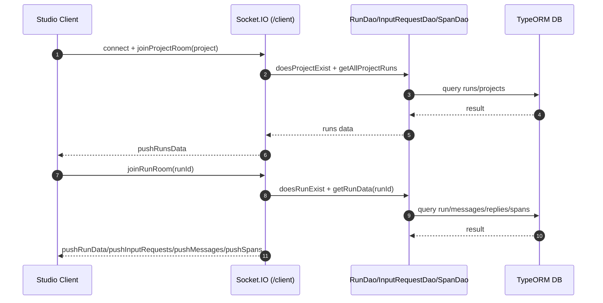

# AgentScope Studio 总体设计

> 代码根目录：`s:\agentscope\agentscope-codebase\agentscope-studio`  
> 主要模块：`packages/server`（服务端）、`packages/client`（前端）

## 1. 定位与目标

Studio 是面向开发者的本地可视化工具，用于：

- 项目（Projects）与运行（Runs）管理
- Chatbot 风格交互展示（运行时消息流）
- Tracing 可视化（OTel spans、模型调用统计）
- 评测与分析（Evaluation）

## 2. 架构概览

Studio 由 **server + client** 构成：

- **Server（Node/Express）**
  - TRPC API：`/trpc`
  - OTEL HTTP 接收：`/v1`（支持 protobuf/octet-stream/json）
  - OTEL gRPC 接收：独立端口启动 gRPC server（失败则退化到仅 HTTP）
  - Socket.IO：向 client 推送 projects/runs/messages/spans 的实时更新
  - DB：TypeORM 管理数据表、视图与迁移
- **Client（Vite/React）**
  - 订阅 Socket.IO 事件获取实时数据
  - 通过 TRPC 拉取/管理项目与运行
  - 展示 traces、token、模型调用等统计

## 3. 关键入口与模块

### 3.1 Server 启动入口

**实现位置**：`agentscope-codebase/agentscope-studio/packages/server/src/index.ts`

启动关键步骤（从代码可见）：

- 读取配置（`ConfigManager`），探测可用 HTTP 端口与 OTEL gRPC 端口（`portfinder`）。
- 初始化 Express + HTTP server。
- 初始化数据库（`initializeDatabase`）。
- 注册路由：
  - `/trpc`：TRPC middleware（`appRouter`）
  - `/v1`：OTEL HTTP（raw body + `otelRouter`）
- 初始化 Socket.IO（`SocketManager.init(httpServer)`）。
- 启动 OTEL gRPC server（`OtelGrpcServer.start(port)`），失败则提示并退化。
- 生产模式下提供静态资源并自动打开浏览器。

### 3.2 数据库层

**实现位置**：`agentscope-codebase/agentscope-studio/packages/server/src/database.ts`

- `initializeDatabase` 以 TypeORM `DataSource` 初始化数据库，加载 entities（Run/Message/Reply/InputRequest/Span 等）并自动运行 migrations。
- 启动时会执行一次“数据刷新”：更新 run 状态与 input request。

### 3.3 Socket 实时推送

**实现位置**：`agentscope-codebase/agentscope-studio/packages/server/src/trpc/socket.ts`

Socket namespaces（从代码可见）：

- `/friday`：Friday app client（可中断 reply）
- `/python`：Python client（run_id 绑定；断连时清理 input requests 并更新 run 状态）
- `/client`：Studio 前端 client（加入 project/run/overview 等房间，接收 runs/messages/spans 推送）

## 4. 主要流程时序图（Client 进入某个 Run）

