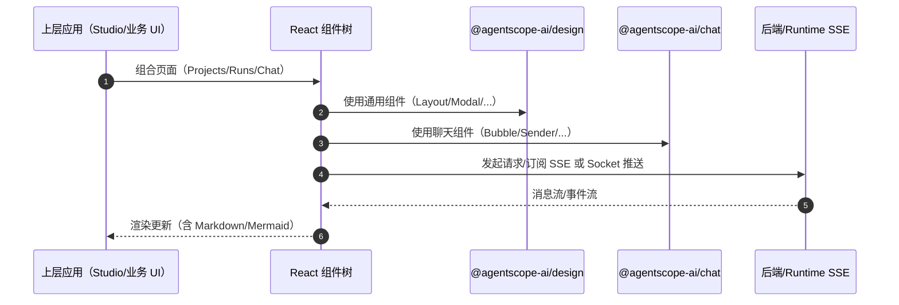

# AgentScope Spark Design 核心模块设计

## 1. `@agentscope-ai/design`（packages/spark-design）

### 1.1 主题与样式（Ant Design 扩展）

- 位置：`packages/spark-design/src/antd`
- 目的：对 Ant Design 5 的 token/theme 做统一封装与增强，保证跨业务一致的视觉语言。

### 1.2 组件体系（common/mobile）

- 位置：`packages/spark-design/src/components`
  - `commonComponents/`：通用组件（Button/Modal/Select/...）
  - `mobileComponents/`：移动端组件（MobileDrawer/MobileModal/...）
- 设计要点：按“可复用 + 可组合”组织，配合 Dumi 文档进行展示与用法规范化。

### 1.3 共享 hooks 与 libs

- 位置：
  - `packages/spark-design/src/hooks`
  - `packages/spark-design/src/libs`
- 作用：沉淀跨组件共享能力（如 SSE 请求封装、弹层请求、等待/轮询工具等）。

### 1.4 国际化（i18n）

- 位置：`packages/spark-design/src/i18n`
- 目标：面向组件库的多语言文案与格式化能力，支撑 zh/en 的文档与组件展示。

## 2. `@agentscope-ai/chat`（packages/spark-chat）

### 2.1 对话 UI 组件

按 README 结构（`agentscope-codebase/agentscope-spark-design/README.md`）包含：

- Bubble（消息气泡）
- Sender（输入与发送）
- Markdown（渲染）
- Mermaid（图表渲染）
- Conversations（会话列表）
- ChatAnywhere（容器化的开箱即用对话 UI）

设计目标：

- 把“LLM 对话 UI”沉淀为组件而非应用逻辑，便于 Studio 与业务 app 复用。

## 3. 文档体系（Dumi）

每个子包可独立构建文档站：

- spark-design：`packages/spark-design/docs`
- spark-chat：`packages/spark-chat/docs`

并通过根脚本聚合构建/部署。

## 4. 主要流程时序图（组件库被上层应用引用）

