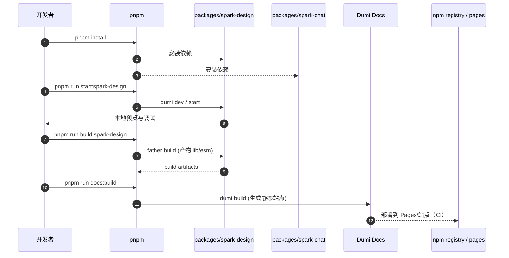

# AgentScope Spark Design 总体设计

> 代码根目录：`s:\agentscope\agentscope-codebase\agentscope-spark-design`

## 1. 定位与目标

Spark Design 是 AgentScope 生态的 UI 组件库仓库（monorepo），主要目标：

- 提供可复用的**设计系统/组件库**（基于 Ant Design 5 的增强封装）
- 提供面向 AI 对话场景的**聊天 UI 组件库**
- 提供可发布的包与可访问的文档站（Dumi）

## 2. 仓库结构（按 README 摘要）

（详见 `agentscope-codebase/agentscope-spark-design/README.md`）

- `packages/spark-design`：`@agentscope-ai/design` 核心组件库
  - `src/antd`：主题与样式扩展
  - `src/components`：通用/移动端组件
  - `src/hooks`：通用 hooks
  - `src/libs`：工具函数（如 requestSse/requestPop 等）
  - `src/i18n`：国际化
  - `docs/`：文档源
- `packages/spark-chat`：`@agentscope-ai/chat` 对话组件库
  - Bubble/Sender/Markdown/Mermaid/Conversations 等
  - `docs/`：文档源
- `package.json` + `pnpm-lock.yaml`：根配置与依赖管理

## 3. 构建与开发约定

根 `package.json`（见仓库文件）提供主要脚本：

- `pnpm install`：安装依赖
- `pnpm run start:spark-design`：启动 spark-design dev server（文档/组件预览）
- `pnpm run start:spark-chat`：启动 spark-chat dev server
- `pnpm run build:*`：构建各子包与文档

## 4. 主要流程时序图（“开发-构建-文档发布”）

