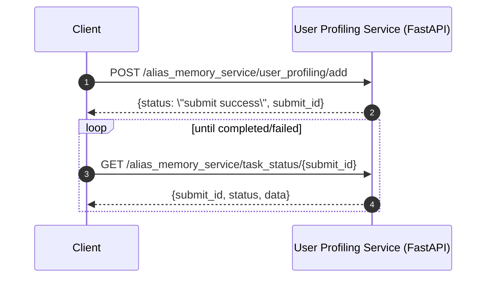

# AgentScope Samples 核心模块设计

本篇从“示例工程的可复用结构”角度抽取核心模块，帮助你在自研项目中复用 Samples 的组织方式。

## 1. 示例目录组织规范

从仓库 README 可总结出约定：

- 按**功能/场景**分组（browser_use / deep_research / conversational_agents / tuner / evaluation 等）。
- 同一主题下提供不同成熟度或不同部署形态：
  - `*_fullstack_runtime`：表示“前端 + 后端 + Runtime”版本
  - 其余：多为纯 Python（仅 AgentScope）

## 2. Prompt / Built-in Prompt 组织

Samples 中大量示例把系统提示词放入独立 Markdown（例如 deep_research、browser_use 的 built_in_prompt 目录），优点：

- 提示词版本可追踪（和代码一样受 Git 管理）
- 便于迭代与 A/B 测试
- 更容易在不同 agent 之间复用

## 3. Fullstack Runtime 示例的“模块边界”

在 `*_fullstack_runtime` 类示例中通常可分为：

- **Frontend**：负责交互与展示（可复用 spark-design/spark-chat 组件）
- **Backend**：负责将用户请求组织为 AgentRequest，并以 Runtime 提供的 AgentApp/Runner 输出事件流
- **Sandbox（可选）**：隔离执行工具（Shell/Browser/FS/GUI 等）

## 4. Alias Memory Service：用户画像/记忆服务（示例模块）

在 `alias/src/alias/memory_service` 下包含一个独立服务，用于用户画像/记忆管理，并提供清晰的 REST API 文档：

- 英文：`docs/API_DOCUMENTATION_EN.md`
- 中文（本地补齐）：`docs/API_DOCUMENTATION_ZH.md`

### 4.1 核心交互模式：异步任务 + submit_id

多数组件（add/clear/record_action）为异步：提交后返回 `submit_id`，客户端通过 task status 查询完成情况。

#### 时序图：提交记忆并轮询任务状态

## 5. 将 Samples “迁移”为自研工程的建议

- **先选范式**：纯 Python（快） vs fullstack runtime（可部署/可观测/可隔离）。
- **把 prompts 与工具 schema 文档化**：延续 Samples 的“提示词 Markdown 化”做法。
- **统一事件流协议**：若服务化，优先使用 Runtime 的 SSE 事件流，便于前端与 Studio 接入。

