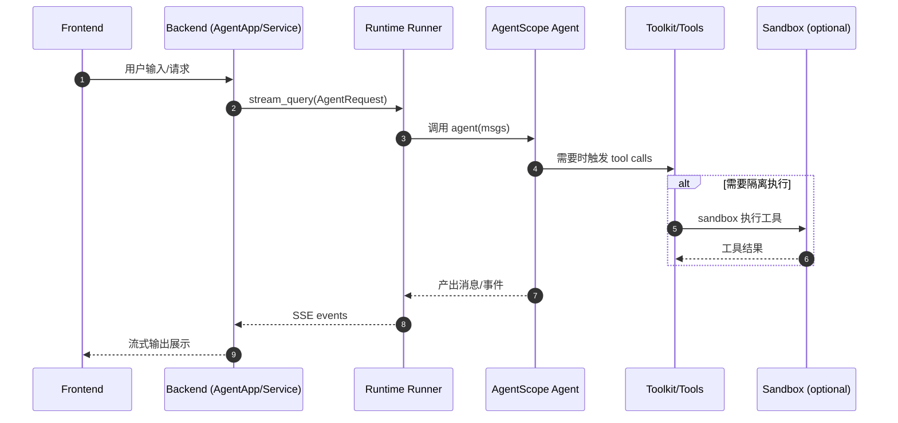

# AgentScope Samples 总体设计

> 代码根目录：`s:\agentscope\agentscope-codebase\agentscope-samples`

## 1. 定位与目标

Samples 仓库提供“可直接运行”的示例集合，覆盖从命令行小工具到 fullstack 应用（前端 + 后端 + Runtime）的落地路径，目标是：

- 快速上手 AgentScope 的核心能力（agent/tool/memory/pipeline）
- 给出常见场景的工程化参考（浏览器自动化、深度研究、多智能体对话、评测、调优等）
- 展示与 AgentScope Runtime 集成后如何服务化与可视化

## 2. 结构组织（按仓库 README）

（详见 `agentscope-codebase/agentscope-samples/README.md`）

- `alias/`：通用 AI Agent（含 fullstack runtime 版本）
- `browser_use/`：浏览器自动化（纯 Python / 进阶 / fullstack runtime）
- `deep_research/`：深度研究（纯 Python multi-agent / fullstack runtime）
- `conversational_agents/`：对话应用（chatbot / fullstack runtime / 多智能体对话、辩论）
- `evaluation/`：评测（ACE Bench）
- `tuner/`：调优（tuning）示例
- `evotraders/`：多智能体交易系统示例

## 3. 两种典型范式

### 3.1 纯 Python（仅 AgentScope）

特征：

- 本地进程内构建 agent（如 `ReActAgent`）
- 通过 Toolkit 注册工具函数
- 通过 Memory 维持上下文
- 用命令行或简单 UI 与用户交互

### 3.2 Fullstack Runtime（AgentScope + Runtime + UI）

特征：

- 后端以 Runtime `AgentApp` 对外暴露 SSE/协议 API
- 前端通过 HTTP/SSE 或 WebSocket 与服务交互
- 工具执行可接入 Runtime Sandbox（隔离执行）
- 可选接入 Studio 进行 tracing 与运行可视化

## 4. 主要流程时序图（fullstack runtime 抽象）

## 5. 与 “设计文档” 的关联

本地补齐的中文设计文档示例：

- `alias/src/alias/memory_service/docs/API_DOCUMENTATION_ZH.md`：用户画像/记忆服务 API 设计说明（从英文翻译补齐）。

